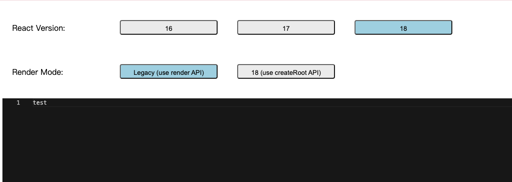
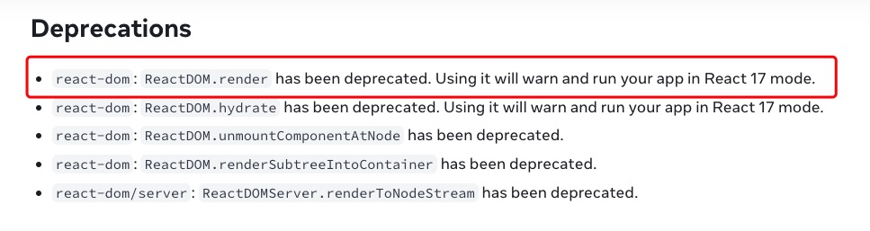

### Issue Description（问题描述）

Rendering a @monaco-editor/react Editor with React 18 using the legacy render API(not the createRoot API), when typing too fast(press 2 keys at the same time), the cursor will jump to the end of the Text Model.

使用 React 18 的 legacy 模式 render API（非 createRoot API） 渲染 @monaco-editor/react 的时候，在 editor 中输入较快的时候，一般来说同时按下两个按钮，会导致光标飘到最后。

### How to reproduce the issue(如何复现)

- install deps using `yarn` or `npm` （使用 `yarn` 或者 `npm` 安装依赖）

- `yarn start` to start the app (`yarn start` 启动应用)

- use `React Version`: `18` and `Render Mode`: `legacy mode`, see below （`React Version` 选择 `18`, `Render Mode` 选择 `legacy mode`，如下）
  

- focus the editor and place the cursor to the start of the Text Model, i.e. before the text `test` (将光标移动到 editor 中的文档开头，也就是 test 之前)

- type whatever things REALLY FAST (快速随便输入任何东西)

- you will find that the cursor jump to the end of the Text Model （你会发现，光标移动到了文档最后）

Note: check out the video `reproduce-issue.mov` to see the behavior

### Why the cursor will move the end of Text Model (为什么光标会移动到文档最后)

Checkout the code below, when the hook detected the `value` is changed, and it's different from the content of current editor, it will run `executeEdits`, this method will move the cursor to the end of Text Model.(查看下边代码，@monaco-editor/react 的 hook 检测到 value 修改，并且和 editor 中当前的内容不一致的时候，会执行 `executeEdits`，该方法会将光标移动到最后)

https://github.com/suren-atoyan/monaco-react/blob/637551552862d3eddffc7e9bb0b84058b8e0275c/src/Editor/Editor.tsx#L102

### Something weird(奇怪的行为)

- Using the `createRoot` API of React 18 to render the APP, this issue won't happen(使用 React 18 的 createRoot api 渲染的时候，不会有这个问题。)

- Using the `render` API of React 17 to render the app, this issue won't happen(使用 React 17 的 render API 渲染时候，也没有这个问题)

- React 18 claims that using the `render` API, it will render the APP in React 17 Mode. But the behaviors of React 18 `render` API and the React 17 are different.(React 官方声称，使用 `render` API 会以 17 的 legacy mode 渲染，但是实际观察，React 18 的 `render` API 和 React 17 的行为是不同的)

 [link](https://react.dev/blog/2022/03/08/react-18-upgrade-guide#deprecations)

### The key problem(核心问题)

So the key questions are(所以核心问题是)

- Why the behaviors of React 18 `render` API and the React 17 are different(为什么 React 18 `render` API 和 React 17 的行为不一致)
- Why is that when using React 18 `render` API, the value is different from the content of the monaco-editor.(为什么使用 React 18 的 render API 渲染 @monaco-editor/react 的时候 value 会和 monaco-editor 的内容不一致)
